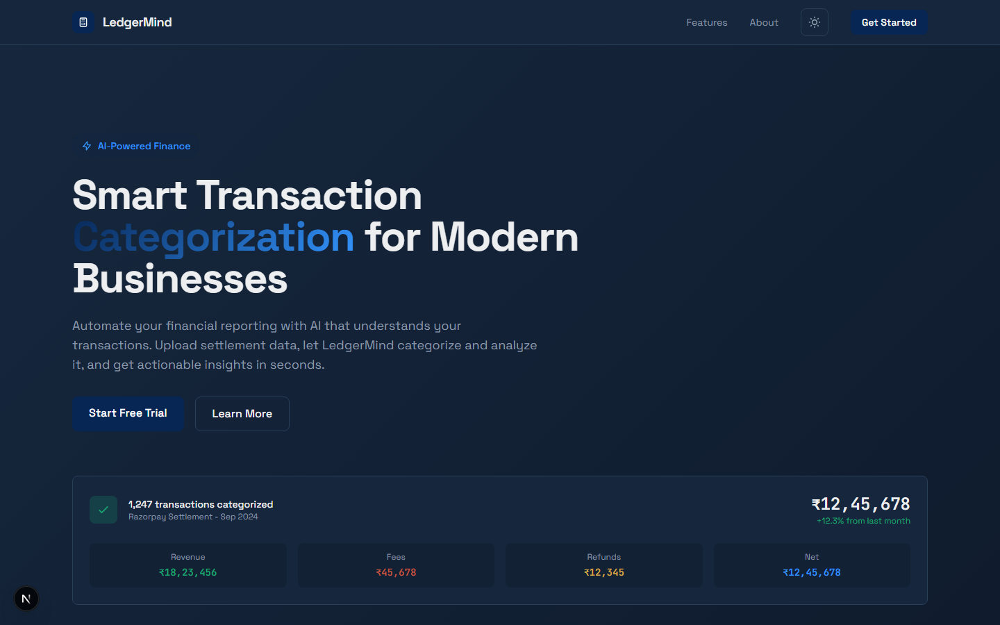
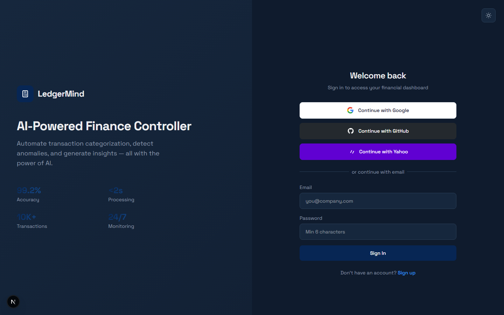

# LedgerMind — AI Finance Controller

An AI agent that ingests Razorpay-style settlement data, categorizes each transaction using an LLM, and auto-generates finance controller reports.

## Quick Start

### Prerequisites
- Python 3.11+
- Node.js 18+
- An [NVIDIA NIM API key](https://build.nvidia.com/) (free tier available)

### Backend Setup

```bash
cd backend

# Install dependencies
pip install -r requirements.txt

# Configure environment
cp .env.example .env
# Edit .env and add your NVIDIA_NIM_API_KEY

# Generate sample data
python -m app.data.synthetic_generator

# Run tests
python -m pytest tests/ -v

# Start the server
uvicorn app.main:app --reload --port 8000
```

### Frontend Setup

```bash
cd frontend

# Install dependencies
npm install

# Start development server
npm run dev
```

Open [http://localhost:3000](http://localhost:3000) in your browser.

## How It Works

1. **Upload** — Drop a Razorpay-style settlement CSV into the upload card
2. **Categorize** — The AI agent processes transactions in batches of 15, using Llama 3.3 70B via NVIDIA NIM
3. **Review** — Dashboard shows categorized transactions with confidence scores and "needs review" flags
4. **Analyze** — P&L summary, category breakdown charts, monthly trends, and anomaly detection

## Screenshots

### Landing Page


### Sign In


## API Endpoints

| Method | Endpoint | Auth | Description |
|--------|----------|------|-------------|
| GET | `/health` | No | Health check |
| POST | `/auth/register` | No | Register a new user account |
| POST | `/auth/login` | No | Login and get JWT token |
| GET | `/auth/me` | Yes | Get current user info |
| POST | `/upload` | Yes | Upload CSV file |
| GET | `/upload/{session_id}/transactions` | Yes | Get raw transactions |
| POST | `/categorize/{session_id}` | Yes | Start LLM categorization (returns 202, background job) |
| GET | `/jobs/{job_id}` | Yes | Poll job status and results |
| GET | `/categorize/{session_id}/results` | Yes | Get categorized results |
| POST | `/reports/generate/{session_id}` | Yes | Generate P&L report |
| GET | `/reports/{session_id}` | Yes | Retrieve report |
| GET | `/sessions` | Yes | List all upload sessions |
| DELETE | `/sessions/{session_id}` | Yes | Delete a session and all related data |

**Auth:** Endpoints marked "Yes" require `Authorization: Bearer <jwt_token>` header.

## CSV Format

```
transaction_id,date,type,amount,description,counterparty,status
txn_MZk3Xy9pQr,2026-07-14,payment,15000.00,"Payment received for order #4421",Flipkart Online Services Pvt Ltd,settled
```

**Required columns:** `transaction_id`, `date`, `type`, `amount`, `description`, `counterparty`, `status`

**Valid types:** `payment`, `refund`, `payout`, `fee`, `chargeback`, `tax`

## Category Taxonomy

| Category | Subcategories |
|----------|---------------|
| Revenue | Subscription Revenue, Service Revenue, Product Sales, Affiliate Revenue |
| Refunds | Full Refund, Partial Refund, Goodwill Credit, Processing Fee Refund |
| Gateway Fees | Payment Processing Fee (MDR), Platform Fee, Settlement Fee, Chargeback Fee |
| Payouts | Merchant Payout, Bulk Settlement, Instant Payout, T+1 Settlement |
| Tax (GST/TDS) | GST Collected, TDS Deducted, TCS Collected, GST Remittance |
| Chargebacks | Chargeback Received, Chargeback Won, Chargeback Lost, Representment |
| Settlements | Settlement Adjustment, Reconciliation Entry, Batch Settlement |
| Other/Uncategorized | Unclassified Transaction, Manual Review Required |

## Design System — "The Audited Ledger"

The UI is designed to feel like a real financial ledger being reviewed by an AI auditor.

- **Colors:** Deep ink navy base (`#0F1B2D`), brass/amber accent (`#C98A3E`), verified green (`#4FA88F`), anomaly red (`#C1553D`)
- **Typography:** Space Grotesk for headers, JetBrains Mono for data/numbers
- **Signature:** "Stamp Reveal" animation on categorization — each row's status animates in with a slight rotation/ink-stamp effect

## Architecture

```
Frontend (Next.js)  →  Backend (FastAPI)  →  NVIDIA NIM API (Llama 3.3 70B)
     :3000                  :8000
```

- **SQLite persistence** — sessions, transactions, categorizations, reports, and jobs stored in SQLite via aiosqlite
- **JWT authentication** — bcrypt password hashing, HS256 tokens, user-scoped data isolation
- **Background jobs** — categorization runs as a background task with status polling via `GET /jobs/{job_id}`
- **Batch processing** — 15 transactions per LLM call to balance cost and latency
- **Deterministic anomaly detection** — rule/statistics-based, not LLM-based, for auditability
- **Graceful degradation** — if a batch fails, those transactions are marked `needs_review: true` instead of failing the entire job
- **LLM retry logic** — exponential backoff on NVIDIA NIM API failures via tenacity

## Tech Stack

- **Backend:** Python 3.11, FastAPI, Pydantic v2, OpenAI SDK
- **Frontend:** Next.js 16, React 19, Tailwind CSS 4, Recharts
- **LLM:** Llama 3.3 70B via NVIDIA NIM API (fast + free tier)
- **Charts:** Recharts (pie/bar for categories, line for trends)
